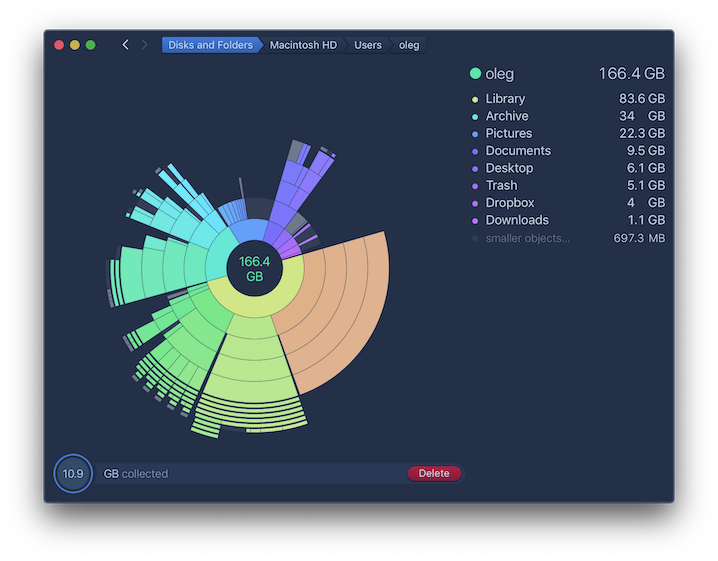
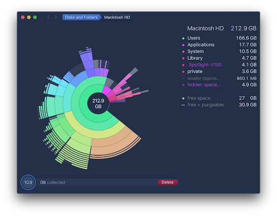
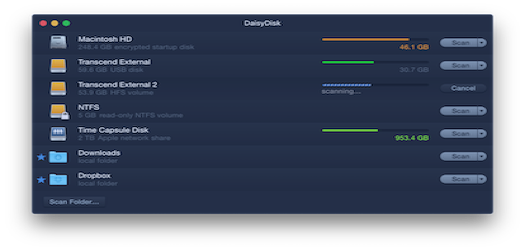
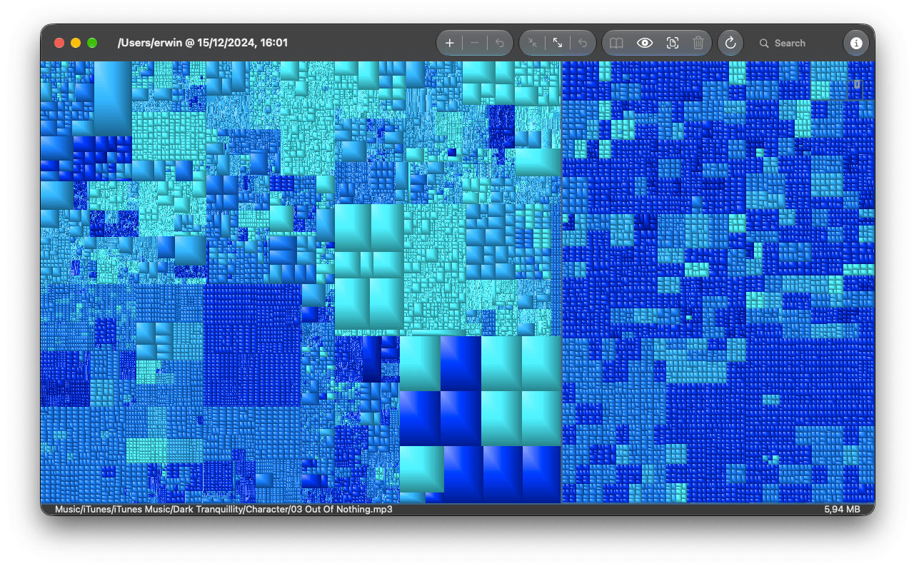
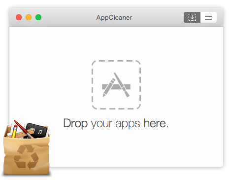
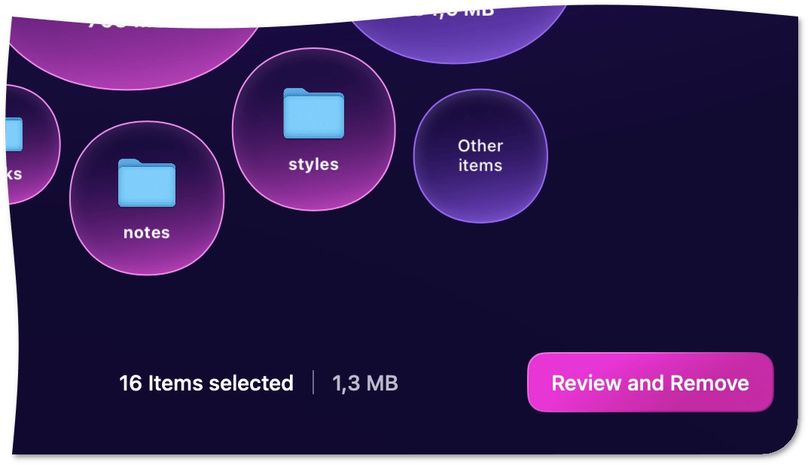
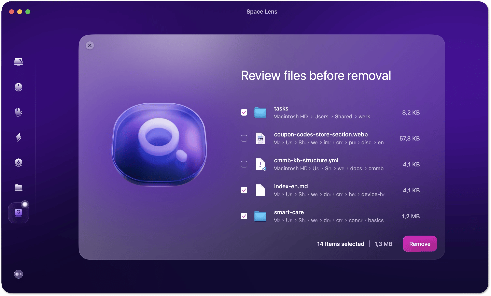
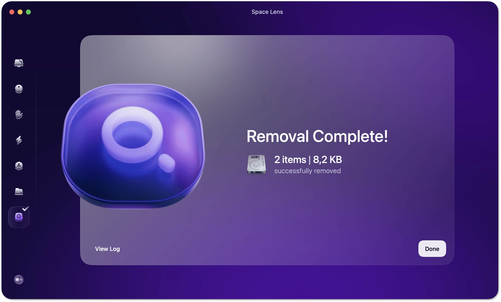

# Tessera UI design research

Date: 2026-09-01  
Scope: the Rescue workflow first, then the complete macOS app shell  
Status: research complete; implementation is in this branch

## Executive decision

Tessera should feel like a calm macOS utility, not a dashboard or a game HUD.
The sunburst is the discovery tool. Rescue is the task surface. The review queue
is the safety boundary.

The redesign uses this sequence:

1. Choose a source and scan it.
2. See one clear answer: how much space is available, what the user is trying
   to finish, and how much space the plan needs.
3. Review a short ranked list. Safe candidates are easy to approve; uncertain
   and protected candidates stay visible but do not compete for attention.
4. Move the approved list to Trash. Show the new measurement and the paths that
   were moved, held, or failed.

The app keeps its dark brand and colorful sunburst, but the content layer is
quiet: system typography, solid surfaces, one accent, fewer cards, and more
native controls. Visual interest belongs to the data, not to every container.

## Method and evidence

I reviewed current first-party guidance and official product material on
2026-09-01:

- Apple Human Interface Guidelines: [design principles](https://developer.apple.com/design/human-interface-guidelines/design-principles),
  [designing for macOS](https://developer.apple.com/design/human-interface-guidelines/designing-for-macos/),
  [layout](https://developer.apple.com/design/human-interface-guidelines/layout),
  [sidebars](https://developer.apple.com/design/human-interface-guidelines/sidebars),
  [materials](https://developer.apple.com/design/human-interface-guidelines/materials),
  [typography](https://developer.apple.com/design/human-interface-guidelines/typography),
  [accessibility](https://developer.apple.com/design/human-interface-guidelines/accessibility),
  [feedback](https://developer.apple.com/design/human-interface-guidelines/feedback),
  [progress indicators](https://developer.apple.com/design/human-interface-guidelines/progress-indicators),
  [buttons](https://developer.apple.com/design/human-interface-guidelines/buttons),
  [alerts](https://developer.apple.com/design/human-interface-guidelines/alerts), and
  [disclosure controls](https://developer.apple.com/design/human-interface-guidelines/disclosure-controls).
- [DaisyDisk official product page](https://daisydiskapp.com/) and its three
  product screenshots.
- [GrandPerspective official site](https://grandperspectiv.sourceforge.net/),
  including its [screenshots](https://grandperspectiv.sourceforge.net/screenshots.html).
- [AppCleaner official site](https://freemacsoft.net/appcleaner/).
- MacPaw's official [CleanMyMac safety guidance](https://macpaw.com/support/cleanmymac/knowledgebase/cleanmymac-safety),
  [Space Lens review flow](https://cms-static.macpaw.com/support/cleanmymac/knowledgebase/space-lens-cleanup),
  and [My Tools navigation](https://macpaw.com/support/cleanmymac/knowledgebase/my-tools).
- [DevCleaner official source repository](https://github.com/vashpan/xcode-dev-cleaner)
  and its [Mac App Store listing](https://apps.apple.com/us/app/devcleaner-for-xcode/id1388020431?mt=12).

The product screens are saved in
`docs/research/tessera-ui-design-research-2026-09-01/references/`.
They are reference evidence, not assets to copy into the app.

## Reference screens

### DaisyDisk: map first, action second

DaisyDisk makes the storage map the hero. Its legend names the largest areas,
the center keeps the current total visible, and the collection action is a
small, stable destination. The interface is colorful because the data is
colorful. It does not need every row to become a decorated card.

The review state preserves context: the selected amount remains visible while
the user decides what to remove. The action is explicit and separate from
exploration.

The source list is compact and scannable. Each source has one clear state and
one next action. This is a better model for Tessera's source rail than stacking
selected, viewing, cached, and capacity badges on the same card.

### GrandPerspective: dense data, restrained chrome

GrandPerspective demonstrates the value of a dense overview: the map fills the
window, controls stay in a predictable top strip, and the selected path is
available without adding explanatory copy to every tile. Tessera should keep
the useful density, but use modern system sizing and clearer empty/loading
states.

### AppCleaner: one obvious beginning

AppCleaner's empty state has one job and one instruction. Tessera's empty state
should work the same way: name the next action, place that action beside the
instruction, and do not send the user to a distant footer.

### CleanMyMac: make review a real step

CleanMyMac's useful pattern is not its gradients. It is the explicit transition
from browsing to “Review and Remove”, with the selected count and amount beside
the action.

The selected list gives each path a visible checkbox, a readable name, a path,
and a size. This maps directly to Tessera's exact-path, owner, physical-size,
and risk requirements.

The result screen closes the loop with a clear outcome. Tessera must preserve
the stronger version of this idea: moved bytes, measured usable-space change,
held paths, failed paths, and any mismatch.

## What Apple says, translated for Tessera

| Evidence | Design rule | Tessera decision |
| --- | --- | --- |
| Apple design principles | Keep only what is necessary; establish hierarchy | One primary task per view. Rescue leads; the map and specialist tools support it. |
| Apple layout | Put important information near the top and leading edge; align related content | Put source, goal, measurement, and next action in the main reading path. |
| Apple macOS guidance | Use the large window for fewer nested levels; let people resize and hide views | Use a larger Rescue sheet and compact rails. Avoid a narrow tool popover for a safety decision. |
| Apple sidebars | Use succinct groups, familiar symbols, and a single clear selection | Simplify source rows to one selected/viewing state. Keep source actions discoverable. |
| Apple materials | Keep Liquid Glass to controls/navigation; do not use it in the content layer | Keep the map and rescue content on solid surfaces. Use depth only where it explains hierarchy. |
| Apple typography | Prefer system fonts and readable weights; avoid light text at small sizes | Remove tiny decorative labels and small caps. Use system text styles and monospaced digits only for measurements. |
| Apple accessibility | Support larger text, visible focus, and comfortable controls; macOS controls should not be smaller than 20 pt | Restore keyboard focus, avoid 8–10 pt interactive text, and give icon-only buttons labels. |
| Apple feedback | Put status near the thing it describes; use determinate progress when possible | Put coverage and measurement status beside the rescue plan. Use a standard progress bar for scans. |
| Apple buttons | The primary button should be the likely nondestructive choice; destructive actions are explicit | “Move to Trash” is primary. Permanent deletion stays behind a separate confirmed action. |
| Apple alerts | Interrupt only for important, irreversible decisions | Keep normal review inline. Use confirmation only at the Trash/permanent-delete boundary. |
| Apple disclosure controls | Use disclosure to hide secondary detail, and do not stack many independent expanders in one view | Show the short reason in each recommendation; keep proof behind one “Proof” disclosure. |

## Current UI audit

The current implementation is functionally careful, but its visual structure
works against that safety model:

- The main window is a fixed three-column composition with two large rounded
  rails, a narrow center, and a full-width bottom dock. The window feels like a
  collection of panels rather than one task.
- All six tools compete in the same toolbar. Rescue opens in a 420-point
  popover, which forces measurement, goals, coverage, risk, ownership, proof,
  and exact paths into a narrow scroll area.
- Rescue shows too many equally weighted bordered cards. “Available”, “Free”,
  “Logical”, “Physical”, source, target, coverage, confidence, side effect, and
  proof are all present, but the user has no strong reading order.
- The cleanup list is a large bottom surface with wrapped chips. It is useful as
  a drop target, but its primary action is placed in the least reliable part of
  the window and its “Empty List” / “Move to Trash” / permanent-delete controls
  look too similar.
- The sidebar source cards combine selected, viewing, cached, total capacity,
  green outlines, and progress bars. The information is correct but visually
  noisy.
- The inspector follows `hoveredNode ?? selectedNode`, so its action target can
  change while the pointer crosses the chart. A destructive or staging action
  should remain attached to the selected item.
- The app uses many uppercased labels and `caption2`/custom 9–10 point text.
  That creates a visual rhythm of tiny badges instead of a calm hierarchy.
- The empty state explains that the user should click a button in the sidebar,
  while the useful scan action is in the center. The first action is split from
  its explanation.
- The scan state uses a custom animated ring even though the task already has a
  progress value. A standard progress treatment would be quieter and more
  informative.
- The full-disk-access screen is already the strongest pattern in the app:
  clear title, short explanation, numbered steps, one primary action, and a
  safe secondary action. The rest of the app should use that discipline.

## Dos and don'ts

### Do

- Lead with the immediate outcome: “Need 20 GB for an update?”
- Keep the current source and the current measurement in the same header block.
- Show one large, readable available-space value. Keep Free, Logical, and
  Physical as supporting values.
- Ask for the user's goal before presenting a long candidate list.
- Use one clear horizontal hierarchy: safe suggestions first, review-only next,
  protected handoffs last.
- Show exact paths in a stable monospaced secondary line. Let names and sizes
  carry the first scan.
- Put the short reason beside the candidate. Keep owner, side effect, and proof
  available without forcing all of them into the first read.
- Make the selected total and the Trash action persistent during review.
- Use text plus icons plus state, not color alone, for safe/review/protected and
  success/failure/mismatch.
- Keep the map visually strong and the surrounding chrome quiet.
- Use standard macOS sheets, menus, text fields, pickers, progress views,
  confirmation dialogs, keyboard shortcuts, and focus behavior.

### Don't

- Do not make the rescue plan a narrow popover.
- Do not make every piece of information its own rounded card.
- Do not put important confirmation actions only in a bottom dock.
- Do not make the user decode “collector”, “purgeable”, “orphan”, “logical”, or
  “physical” before they understand the next action.
- Do not use all-caps headings, tiny labels, or light weights as decoration.
- Do not use gradients, glows, colored shadows, or faux-glass plates behind
  content. They compete with the storage map and weaken text contrast.
- Do not show safe, review, and protected rows as three equally strong calls to
  action.
- Do not preselect ambiguous items to make the result look more impressive.
- Do not collapse a failed verification into a success toast.
- Do not use hover as the source of truth for an action target.

## Applied design system

- Content surfaces are solid and layered in only three levels: window, panel,
  and selected/interactive state.
- Radius is reduced to a consistent, quiet 12–16 point range. Shadows are
  minimal and neutral.
- The cyan accent marks the current selection, progress, and primary action.
  Orange means review or a warning. Red is reserved for irreversible failure or
  permanent deletion.
- The system font carries hierarchy. Headlines use regular/semibold weights;
  measurements use monospaced digits; paths use a monospaced face only where it
  helps recognition.
- Tool navigation uses one primary Rescue action plus a named Tools menu. The
  tool content opens in a larger sheet with enough width for exact paths.
- The Rescue sheet has this reading order: source and phase → available space
  and goal → coverage → suggested cleanup → review-only and protected items.
- Recommendation rows show name/path/size first, then reason, then expandable
  proof. Group actions stay on the group header.
- The review queue stays a visible drop target, but its controls use clear
  labels and a strong distinction between “Empty list” and “Move to Trash”.
- The inspector is anchored to the selected item, not transient hover.
- Empty and loading states state the next action in the same place as the
  explanation.

## Acceptance checklist

- [x] Rescue uses a roomy sheet instead of a cramped popover.
- [x] The primary path is visible: goal → measured space → ranked candidates → review → Trash → verify.
- [x] Safe, review-only, and protected candidates remain distinct.
- [x] Exact path, owner, physical/logical size, reason, side effect, confidence,
  and proof remain available.
- [x] No action silently broadens from Trash to permanent deletion.
- [x] The empty state owns its scan CTA.
- [x] The inspector remains stable while hovering the chart.
- [x] The scan state uses readable, meaningful progress.
- [x] The interface keeps system text styles, native keyboard focus, VoiceOver
  labels, and reduced-motion guards.
- [ ] Run a native visual pass at 390, 820, 1440, and 1920px and capture the
  finished app on a macOS runner.

The authoring environment is Linux, so the native visual pass is still open.
The source screenshots above validate the research direction; the macOS CI
build validates compilation and tests, but it does not replace rendered
visual inspection.

## Source notes

The research deliberately separates evidence from design taste. DaisyDisk,
GrandPerspective, AppCleaner, CleanMyMac, and DevCleaner are not copied as
brands or visual skins. Their useful behaviors are translated into Tessera's
existing safety contract: local analysis, exact paths, narrow defaults, Trash
first, and measured verification.
